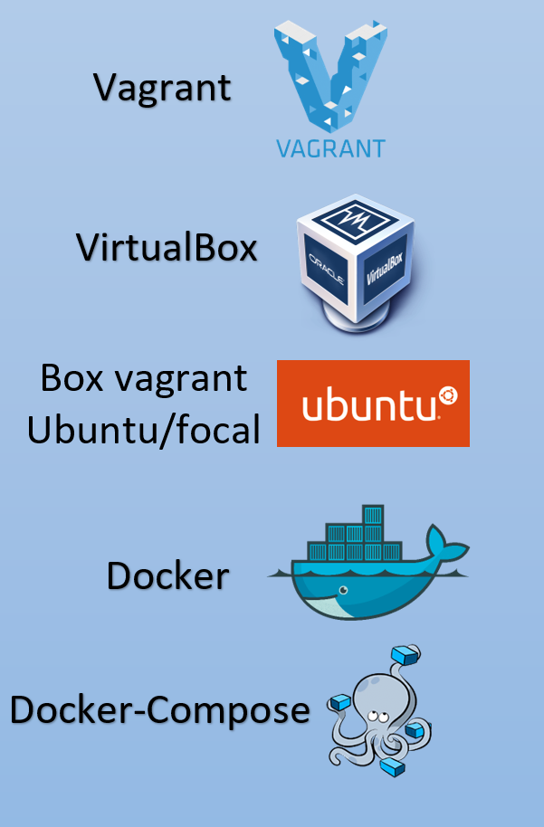
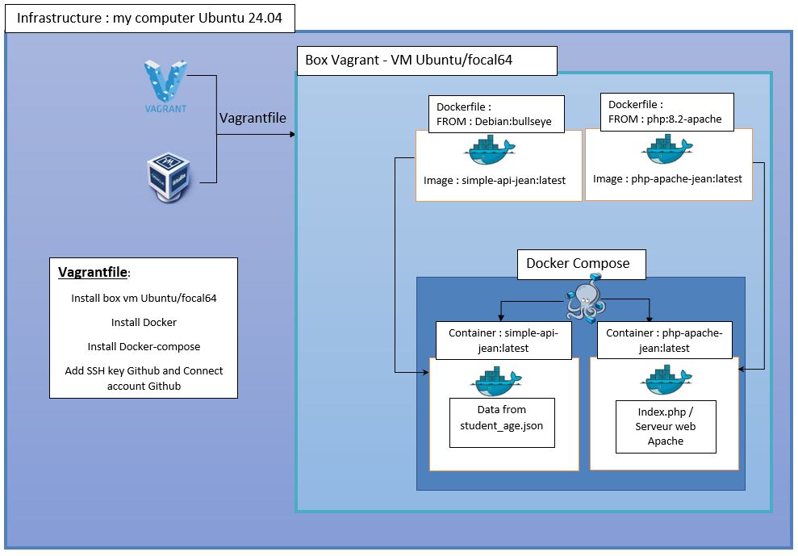

# Project DevOps V1 | Docker & Docker-Compose

## Vagrant 2.4.1 - VirtualBox 7.0.16 - Ubuntu/focal64 (Vagrant Box)  

#
# Infrastructure Automation

#
## Create file .env
### DOCKER_USER=XXXXXXXXXXXXX
### DOCKER_PASS=XXXXXXXXXXXXX
### GITHUB_USER=Jean1084
### GITHUB_TOKEN=XXXXXXXXXXXXXXXXXXXXXXXXXXXXXXXXXXXXXXXXXXXXXXXXXXXXXXXXXXX

#

## With only : "vagrant up"

* ### vm Ubuntu/focal
* ### install Docker
* ### install Docker-Compose
* ### add ssh key in my account Github
* ### Connect to account Github
* ### git clone project
* ### create image Docker
* ### connect to Docker Hub
* ### Push image on Docker Hub
* ### Run docker-compose
#
## Test the API in command line :
### curl -u jean:agree -X GET http://127.0.0.1:4000/simple-jean/api/v1.0/get_student_ages

### curl -u jean:agree -X GET http://localhost:4000/simple-jean/api/v1.0/get_student_ages

### output :
### {
###  "student_ages": {
###    "alice": "12", 
###    "bob": "13"
###  }
### }
#
## Test the API in a browser of the host :

### <ip_vm>:8082 ==> no access data
### docker-compose ps in vm get <name_container_simple-api-jean>
### update file index.php
### before ==> http://<name_container_simple-api-jean:port>/simple-jean/api/v1.0/get_student_ages
### after ==> http://workspace-service-simple-api-jean-1:5000/simple-jean/api/v1.0/get_student_ages
### After that
### <ip_vm>:8082 ==> access data