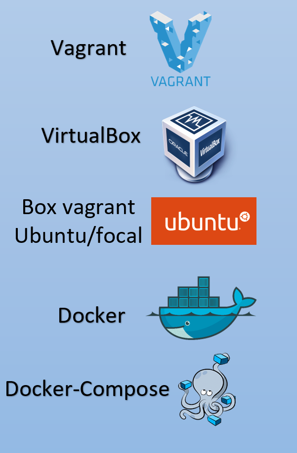
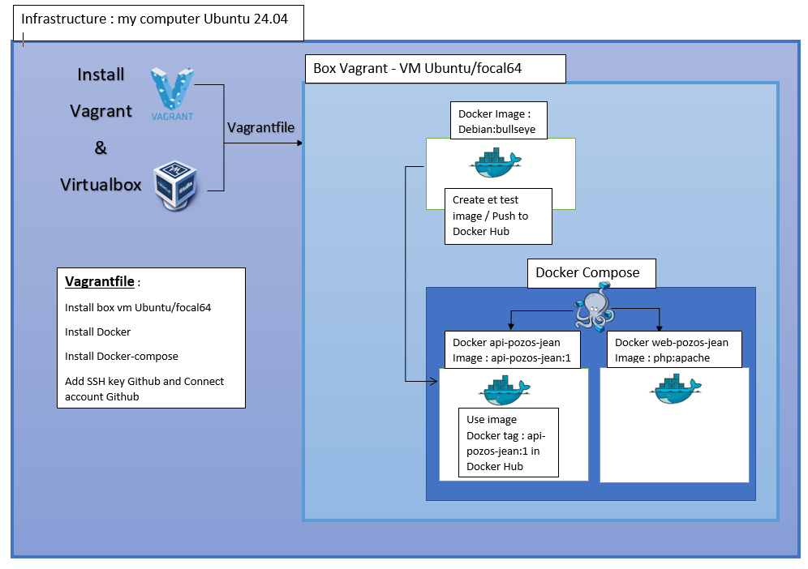

# Project DevOps V1 

## Vagrant 2.4.1 - VirtualBox 7.0.16 - Ubuntu/focal64 (Vagrant Box)  

#
# Infrastructure Automation

## Create folder .env
### DOCKER_USER=XXXXXXXXXXXXX
### DOCKER_PASS=XXXXXXXXXXXXX
### GITHUB_USER=Jean1084
### GITHUB_TOKEN=XXXXXXXXXXXXXXXXXXXXXXXXXXXXXXXXXXXXXXXXXXXXXXXXXXXXXXXXXXX

#

## With only : "vagrant up"

* ### vm Ubuntu/focal
* ### install Docker
* ### install Docker-Compose
* ### add ssh key in my account Github
* ### Connect to account Github
* ### git clone project
* ### create image Docker
* ### connect to Docker Hub
* ### Push image on Docker Hub

## To test the API
### curl -u jean:agree -X GET http://127.0.0.1:4000/simple-jean/api/v1.0/get_student_ages

### curl -u jean:agree -X GET http://localhost:4000/simple-jean/api/v1.0/get_student_ages

